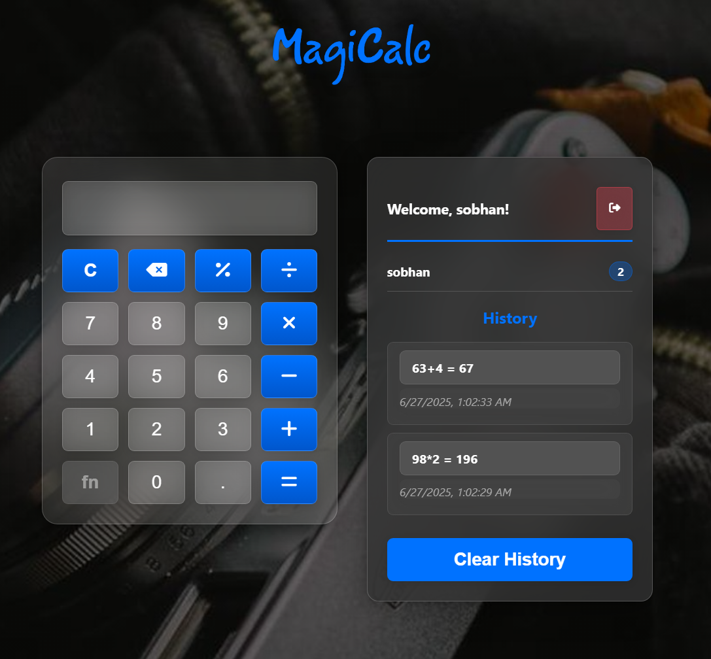

# 🧮 MagiCalc - Modern Calculator with Firebase Integration

A beautiful, modern calculator web application built with HTML, CSS, and vanilla JavaScript. Features a glassmorphic design, Firebase integration for user authentication and history storage, and a responsive mobile interface.



## ✨ Features

### 🎨 Modern Design
- **Glassmorphic UI**: Beautiful frosted glass effect with backdrop blur
- **Random Backgrounds**: Dynamic background images from Picsum Photos
- **Responsive Design**: Works perfectly on desktop and mobile devices
- **Smooth Animations**: Elegant transitions and hover effects

### 🔐 User Authentication
- **Username-based Login**: Simple login system with persistent sessions
- **Firebase Integration**: Secure user data storage and synchronization
- **Session Management**: Automatic login state restoration

### 📊 Calculation History
- **Persistent Storage**: All calculations saved to Firebase and localStorage
- **User-specific History**: Each user has their own calculation history
- **Mobile History Panel**: Dedicated history overlay for mobile devices
- **Click to Reuse**: Click any history item to reuse the result

### 🧮 Advanced Calculator Features
- **Basic Operations**: Addition, subtraction, multiplication, division
- **Special Functions**: Percentage calculations, decimal support
- **Error Handling**: Division by zero detection with user-friendly messages
- **Backspace Support**: Easy correction of input mistakes
- **Clear Function**: Reset calculator state

### 📱 Mobile Optimized
- **Touch-friendly Interface**: Large buttons optimized for mobile use
- **Mobile History Overlay**: Dedicated mobile history panel
- **Responsive Layout**: Adapts to different screen sizes
- **Mobile User Info**: Username and logout button in mobile history

## 🚀 Getting Started

### Prerequisites
- A modern web browser (Chrome, Firefox, Safari, Edge)
- Firebase project (for full functionality)

### Installation

1. **Clone the repository**
   ```bash
   git clone https://github.com/sobhan-shahamatnia/magicalc_v2.git
   cd magicalc_v2
   ```

2. **Set up Firebase** (Optional)
   - Create a Firebase project at [Firebase Console](https://console.firebase.google.com/)
   - Enable Firestore Database
   - Update the Firebase configuration in `javascript/firebase-config.js`

3. **Open the application**
   - Open `index.htm` in your web browser
   - Or serve it using a local web server

### Local Development Server
```bash
# Using Python 3
python -m http.server 8000

# Using Node.js (if you have http-server installed)
npx http-server

# Using PHP
php -S localhost:8000
```

Then visit `http://localhost:8000` in your browser.

## 🛠️ Technology Stack

- **Frontend**: HTML5, CSS3, Vanilla JavaScript
- **Backend**: Firebase (Authentication & Firestore)
- **Styling**: Custom CSS with glassmorphic effects
- **Icons**: Font Awesome
- **Backgrounds**: Picsum Photos API

## 📁 Project Structure

```
magicalc_v2/
├── index.htm                 # Main HTML file
├── css/
│   └── style.css            # Main stylesheet
├── javascript/
│   ├── javascript.js        # Main application logic
│   └── firebase-config.js   # Firebase configuration
├── assets/
│   ├── logo.png             # Application logo
│   ├── Sc.png               # Demo screenshot
│   └── fav/                 # Favicon files
└── README.md                # This file
```

## 🎯 Key Features Explained

### Division by Zero Handling
The calculator intelligently detects division by zero attempts and:
- Shows "Can't divide by zero" message
- Preserves the original calculation in history
- Allows users to see what they attempted to calculate

### Glassmorphic Design
Modern UI with:
- Backdrop blur effects
- Semi-transparent backgrounds
- Subtle shadows and borders
- Smooth transitions

### Firebase Integration
- User authentication with username
- Real-time calculation history sync
- Persistent data across devices
- Offline support with localStorage fallback

## 🔧 Configuration

### Firebase Setup
1. Create a new Firebase project
2. Enable Firestore Database
3. Update the configuration in `javascript/firebase-config.js`:

```javascript
const firebaseConfig = {
  apiKey: "your-api-key",
  authDomain: "your-project.firebaseapp.com",
  projectId: "your-project-id",
  storageBucket: "your-project.appspot.com",
  messagingSenderId: "your-sender-id",
  appId: "your-app-id"
};
```

## 📱 Mobile Features

- **Touch-optimized buttons**: Large, easy-to-tap calculator buttons
- **Mobile history overlay**: Dedicated mobile history panel
- **Responsive design**: Adapts to all screen sizes
- **Mobile user controls**: Username display and logout in mobile history

## 🎨 Customization

### Changing Colors
The primary color can be modified in `css/style.css`:
```css
:root {
  --primary-color: #0072ff; /* Change this to your preferred color */
}
```

### Background Images
The app uses random images from Picsum Photos. You can modify the background source in the JavaScript file.

## 🤝 Contributing

1. Fork the repository
2. Create a feature branch (`git checkout -b feature/AmazingFeature`)
3. Commit your changes (`git commit -m 'Add some AmazingFeature'`)
4. Push to the branch (`git push origin feature/AmazingFeature`)
5. Open a Pull Request

## 📄 License

This project is open source and available under the [MIT License](LICENSE).

## 🙏 Acknowledgments

- [Font Awesome](https://fontawesome.com/) for the beautiful icons
- [Picsum Photos](https://picsum.photos/) for the random background images
- [Firebase](https://firebase.google.com/) for the backend services

## 📞 Support

If you have any questions or need help, please open an issue on GitHub or contact the maintainers.

---

**Made with ❤️ by [Sobhan Shahamatnia](https://github.com/sobhan-shahamatnia)** 